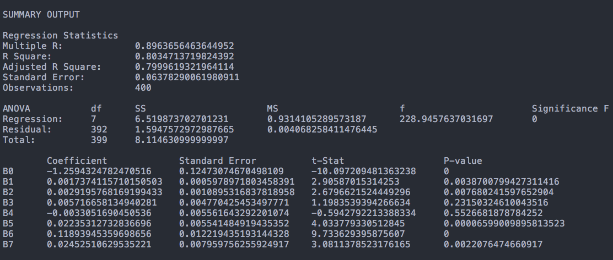

# regression
Multiple Linear Regression



## Usage
```
cargo run --release file.csv
```
or...
```
./regression file_path.csv
```

## Notes
* The first column in the csv file will be read as the dependent variable
* All other columns will be read as independent variables
* The output is tab seperated so you can copy+paste into a spreadsheet
